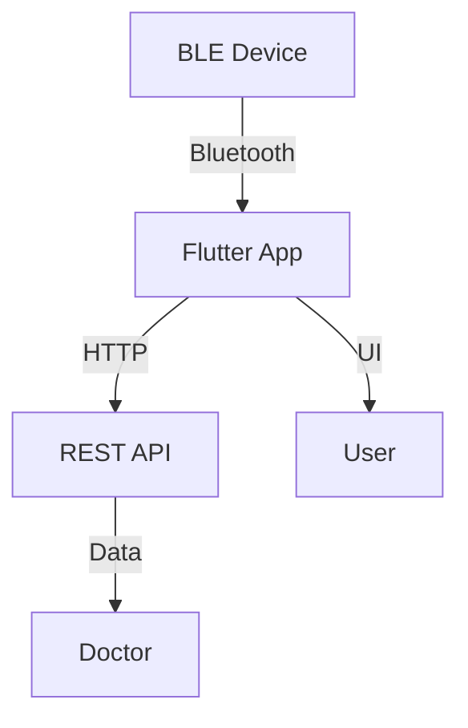
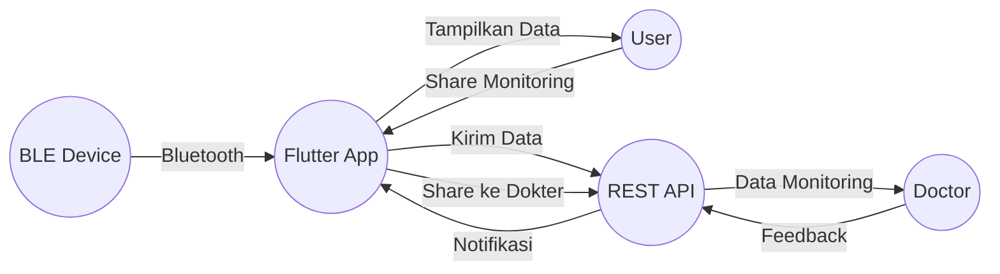

# Architecture & Design

Aplikasi Dopply menggunakan arsitektur modular berbasis Flutter yang memisahkan logika bisnis, presentasi, dan data agar mudah dikembangkan, diuji, dan dipelihara.

## Diagram Arsitektur

## Penjelasan Komponen

- **BLE Device:** Perangkat kesehatan yang mengirim data BPM dan status ke aplikasi.
- **Flutter App:** Aplikasi mobile yang menerima, memproses, dan menampilkan data. Terdiri dari beberapa layer:
  - *Presentation Layer*: Widget, UI, navigasi
  - *Business Logic Layer*: State management (Riverpod), service
  - *Data Layer*: Model, API service, storage
- **REST API Backend:** Server yang menyimpan data monitoring, mengelola user, dan dokter.
- **User:** Pasien yang melakukan monitoring dan berbagi data.
- **Doctor:** Dokter yang menerima data monitoring dari pasien.

## Prinsip Desain

- **Modular:** Setiap fitur (monitoring, history, share, notifikasi) dipisahkan dalam folder dan file terstruktur.
- **Reusable:** Widget dan service dibuat agar dapat digunakan ulang di berbagai bagian aplikasi.
- **Scalable:** Mudah menambah fitur baru tanpa mengganggu kode yang sudah ada.
- **Testable:** Struktur mendukung unit test dan widget test.
- **Maintainable:** Kode mudah dipahami dan didokumentasikan.

## Alur Data

1. Data monitoring dikirim dari BLE device ke Flutter app.
2. Flutter app memproses dan menampilkan data ke user.
3. Data dikirim ke backend melalui REST API.
4. User dapat membagikan hasil ke dokter.
5. Dokter menerima data dan memberikan feedback melalui backend.

## Teknologi & Library

- **Flutter (Dart):** UI, logic, multiplatform
- **Riverpod:** State management
- **go_router:** Navigasi
- **flutter_blue_plus:** Koneksi BLE
- **http:** Komunikasi REST API

---
